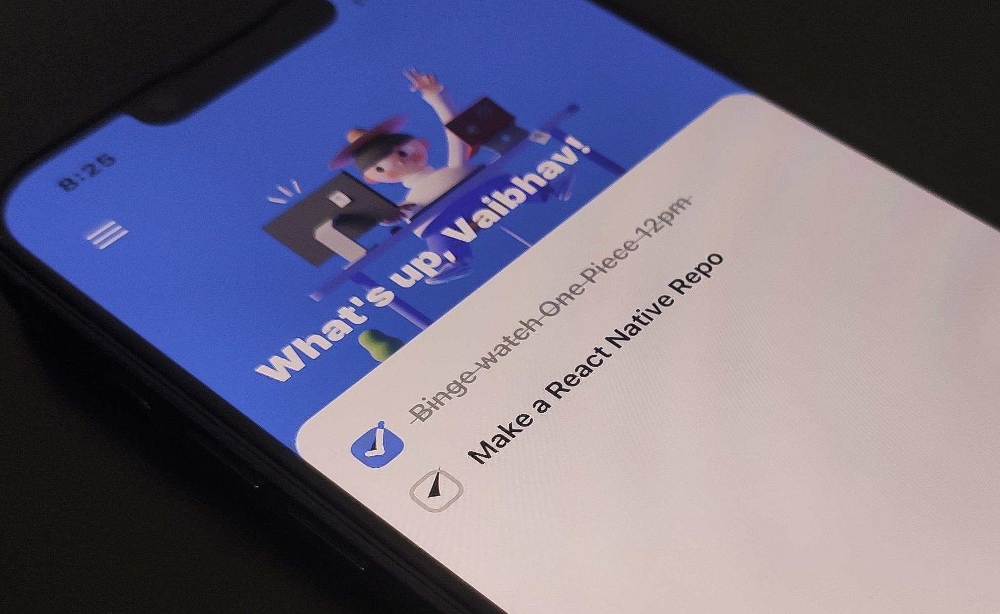

# 📝 React Native ToDo App



Try the demo on []


## 🚀 Tech Stack

- [React Native](https://reactnative.dev/)
- [Expo](https://expo.dev/)
- [React Navigation](https://reactnavigation.org/)
- [NativeBase](https://nativebase.io/)
- [Reanimated](https://docs.swmansion.com/react-native-reanimated/)
- [SVG](https://github.com/react-native-svg/react-native-svg)
- [Moti](https://moti.fyi/)

## 📁 Project Structure

```
$PROJECT_ROOT
├── App.tsx        # Entry point
└── src
    ├── screens    # Screen components
    ├── components # UI components
    ├── utils      # Custom hooks and helpers
    └── assets     # Image files
```


## 🛠️ How to Get Started

1. Clone the repository: `git clone https://github.com/ryucraftz/animated-todo.git`
2. Install dependencies: `yarn`
3. Start the app: `yarn start`

Open Expo Go on your 📱, scan the QR code, and dive into the app.

Feel free to customize and enhance it to fit your needs!
